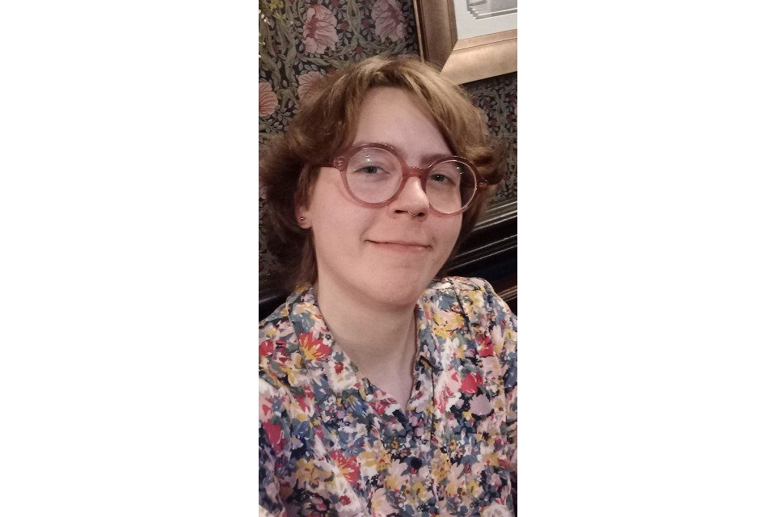

I'm **Stella Aster&nbsp;✨**, a socially engaged creative practicioner from Leyland,&nbsp;Central Lancashire. My work looks at how art, social research, and activism can be used to support local communities and cultures.

I'm currently working on a number of projects, most of which are focused on my home of [Central Lancashire, an urban area roughly centred on the Bamber Bridge Interchange](https://www.openstreetmap.org/?mlat=53.7154&mlon=-2.6613#map=12/53.7154/-2.6613):

- The **Central Lancashire End Weight Stigma** project aims to dismantle weight stigma in healthcare within Central Lancashire. I am founding and caretaking this project as part of my PhD studies at Leeds Beckett University.

- I'm building a **'communities and cultures' map of Central Lancashire**. I'm currently having a lot of conversations so I can produce an initial version to share publicly.

- I'm running a survey on [**funding opportunities available to individuals and small groups in Central Lancashire**](https://docs.google.com/forms/d/e/1FAIpQLSe0F6q5CbDGJKjWwzNzRyeHnCDCnHU8G5ePHPvuAea1E7lXwg/viewform). Please fill this in if you know of any, and pass it on to someone else!

- I'm designing a number of events that aren't ready to be announced yet&nbsp;😊

- [**Open Letters**](https://stella-aster.com/open-letters) is an experimental journal project which looks at the role of conversation in meaning-making. I'm currently working with submitters to produce the first issue.

- I'm delivering **Build a Website workshops** to Preston Co-Operative Development Network through January and February 2025.

- I help facilitate the **Leyland Trans Group**&nbsp;🏳️‍⚧️

Some of the other things I've been working on recently include:

- [**Music by Belisha beacons**](https://music-by-belisha-beacons.co.uk/), where I turned zebra crossing beacons into musicians. The piece was covered in [Blog Preston](https://www.blogpreston.co.uk/2024/12/new-living-data-music-piece-by-leyland-artist-stars-two-sets-of-belisha-beacons/) and the Lancashire Post. I'm aiming to deliver an installation sometime in 2025.

- I perform **poetry** at events across Central Lancashire, and I run the [**Central Lancashire Spoken Word WhatsApp channel**](https://whatsapp.com/channel/0029Vb3z0ASJP210e0AEI21V) to keep people updated about events in Preston, Leyland, Chorley, and beyond&nbsp;😊 My poetry has also been published in [Pressed Town](https://www.instagram.com/pressedtown/){target="_blank"} and is currently due for publication in some other places!

- I have done some **campaigning** in the past on the Department for Education's 2024 consultation into RSHE (relationships education, relationships and sex education, and health education) in England.

If you would like to support me and my work, please get in touch! I am eager to hear from people and to find opportunities to work together 😊

Sincerely,  
[Stella ✨ <small>\<hello@stella-aster.com\></small>](mailto:Stella ✨ <hello@stella-aster.com>)  
