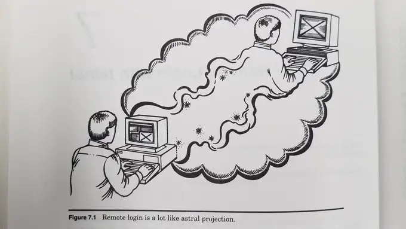

words, language
speech and writing
speech is the original word, the first word
Butler, representing ourselves in text, ...
reading as much as writing, listening as much as speaking

where do words live, when they sleep?
do they sit waiting in the back of our minds?
enrobed in teletype darkness?

itching to burst forth or fade in.

where was the first word born?
in an ear of a mind of a (stoned) ape?
in a chain of peptides in a pool of soup?
in a sound of a forest on the lips of a bird?
in a glance or look?

> For this "I" that you read is in part a consequence of the grammar that governs the availability of persons in language. I am not outside the language that structures me, but neither am I determined by the language that makes this "I" possible.

-- Butler, Judith. Gender Trouble: Feminism and the Subversion of Identity. Routledge, 2011.

for I am partly in words,
written in text and flesh,
pressure waves shadows of flapping flesh.
words are another way to be,
as fleeting as a heartbeat.
how could I live without words?
how much of my being is wrapped up in them,
smoke held inside bandages?

strange how sight and sound are linked,
but "experiments suggest that the sensory regularities and mental images  concerning bouba and kiki do not have to be based on, or even include visual information",
so what do they tell us?
maybe sound and imagination, or mind?
